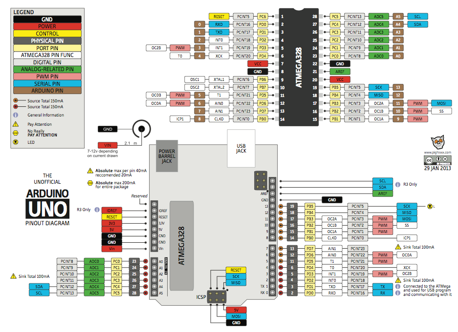
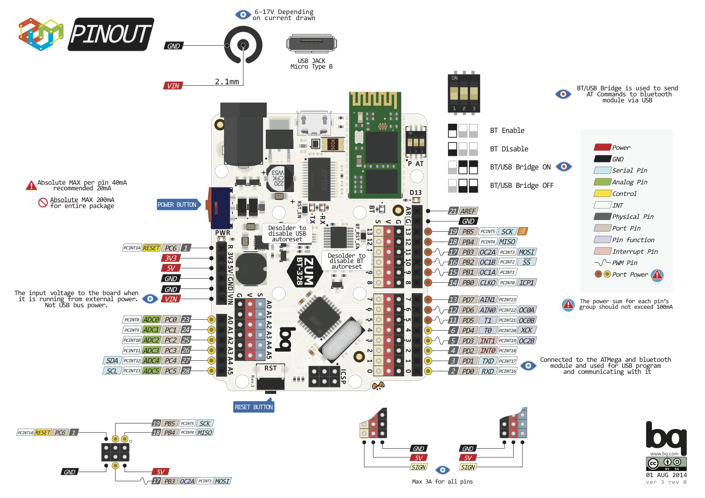
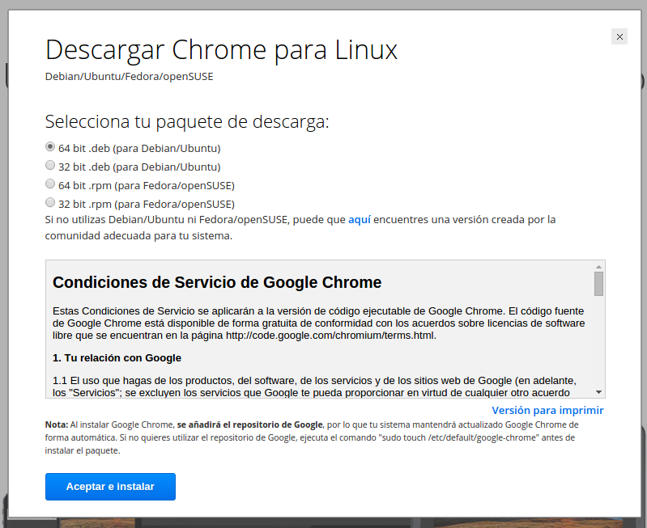

# Curso Básico presencial de Arduino

## Organizado por Darwin Eventur

### 14-16 diciembre 2016

## [Programa](./programa.md)

### José Antonio Vacas @javacasm

## [https://github.com/javacasm/ArduinoDE_2016](https://github.com/javacasm/ArduinoDE_2016)

# Arduino

Si hay un producto que puede representar el boom de la irrupción de la tecnología en el aula ese es Arduino

## Así lo vemos nosotros

[más detalle](./images/ArduinoUno_R3_Front.jpg)

## Así es internamente
#### (mucho por descubrir)

Y si usamos una versión "mejorada" BT-ZUM ...

## [¿qué es arduino?](./presentaciones/0.0 - Introducción a Arduino.pdf)

* * *

# Para hacer un proyecto necesitamos:

* ### Programa

* ### Montaje ([electrónica](./presentaciones/4.0%20-%20Introducci%C3%B3n%20a%20la%20electr%C3%B3nica.pdf))

### ¿Qué es un programa? un conjunto de instrucciones ordenadas

#### Programa parpadeo (blink)

* Encendemos
* Esperamos
* Apagamos
* Esperamos
* Volvemos al principio

#### (descargar el programa en la placa)

#### Instalación de Bitbloq

1. Se recomienda usar chrome, para que funcione al 100%. Podemos descargarlos desde [aquí](http://chrome.google.com). Para instalar la versión adecuada necesitamos saber si nuestro sistema operativo es de 32 o de 64 bits

2. Una vez que tengamos nuestro programa  y pulsamos el icono de la flecha para descargar el programa a Arduino. Para instalar la versión adecuada necesitamos saber si nuestro sistema operativo es de 32 o de 64 bits

#### [Instalación del IDE de arduino](http://www.slideshare.net/javacasm/32-instalacin-del-ide)

## Ejemplos

* [Casa domótica](http://www.slideshare.net/josepujolperez/memoria-casa-inteligente-con-s4a?utm_source=slideshow&utm_medium=ssemail&utm_campaign=upload_digest)
* [Proyectos](http://www.instructables.com/id/Arduino-Projects/)
